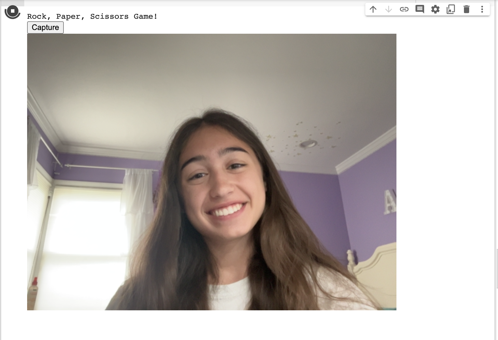
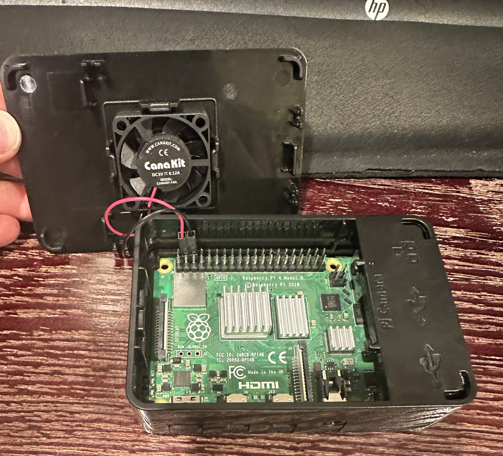
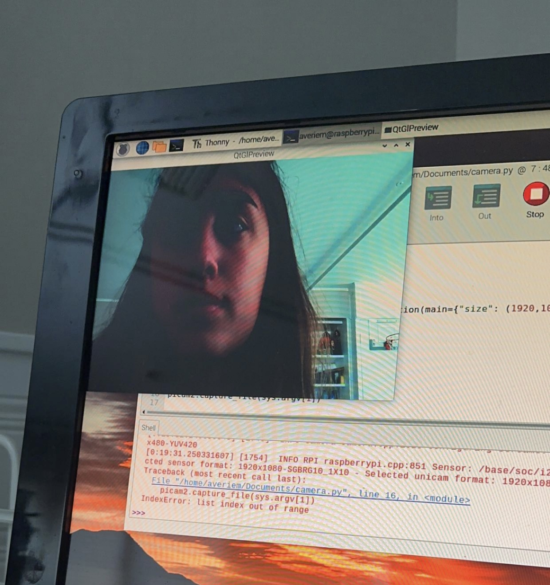

# Rock, Paper, Scissors Game with Image Recognition
Since the dawn of technology, computers have been there as a friend to those who need one in the moment, with games created to take the place of a human counterpart.  The game I created provides some company in a game as classic as it can get: rock, paper, scissors.  Though originally starting as a raspberry pi project, I've made something that I'm equally as proud of and learned while doing it that part of engineering is adapting and growing with your project.

| **Engineer** | **School** | **Area of Interest** | **Grade** |
|:--:|:--:|:--:|:--:|
| Averie M | Schreiber High School | Computer Science | Incoming Senior


  
# Final Milestone

<iframe width="560" height="315" src="https://www.youtube.com/embed/JKLz-hdu-_E" title="YouTube video player" frameborder="0" allow="accelerometer; autoplay; clipboard-write; encrypted-media; gyroscope; picture-in-picture; web-share" allowfullscreen></iframe>

The final outcome of my project is a game which the user can decide if they want to play or not and a computer will play against them.  In the end, this computer is told to start cheating and win every time after the user wins 5 rounds.  At this program I've learned about machine learning, overfitting a model, python coding, the command line, and more.  Although I faced more challenges than I anticipated, I am glad that I did because it taught me more than if everything had simply gone smoothly.  Though my raspberry pi discouraged me, using Google Colab expanded my computer science knowledge and I couldn't be happier.

# Second Milestone

<iframe width="560" height="315" src="https://www.youtube.com/embed/Saz_tLSkUOA" title="YouTube video player" frameborder="0" allow="accelerometer; autoplay; clipboard-write; encrypted-media; gyroscope; picture-in-picture; web-share" allowfullscreen></iframe>

Continuing working in colab, for my second milestone I advanced into making image detection a working game.  Trying to address some issues I saw in my first milestone with correctly identifying the images, I looked back through the original data set (that was used for training the model) and figured out how to most efficiently crop the image that my camera was taking so that my hand would be similar to the hands that trained the machine learning model.  In the future I want to work on making the code flow more smoothly and also giving the computer the option to cheat to win.  The original project I selected had used the pi camera to track the movements of the player's hand and accurately guess what move they are going to make, so I want to include a flare of that in my final project.

# First Milestone

<iframe width="560" height="315" src="https://www.youtube.com/embed/iWbenZ6Ey8c" title="YouTube video player" frameborder="0" allow="accelerometer; autoplay; clipboard-write; encrypted-media; gyroscope; picture-in-picture; web-share" allowfullscreen></iframe>

The original project I selected would've included a raspberry pi and a pi camera; however, technical difficulties led me to switch gears and move to working solely with google colab.  My original objective when choosing this project was to learn about machine learning and be able to apply training a model to a data set other than the Rock, Paper, Scissors images.  Although these issues are not ideal, I know that they are a huge part of the engineering process, especially if I decide to continue into Computer Science.  For this first milestone I was able to connect my camera to google colab and correctly identify whether the picture I took was Rock, Paper, or Scissors and though when I selected the project I thought I'd be using the command line to code on the raspberry pi, coding with python on google colab has still been enriching.  

# Progress Pictures


This picture was taken when I successfully constructed my raspberry pi computer and hooked it up to my monitor.


After downloading packages and updates, I successfully connected my picam to my raspberry pi and took a picture with the camera.


# Code
My code is broken into two main parts, the setup code, and the game code.  The setup code involves taking a picture of your hand, cropping it, and identifying it (all of these are defined as functions to be called on in the game code).  The setup code could've been in the same block on google colab as the game code, however for aesthetic sake it looks more organized to have the setup code as callable functions.  The game code utlitzes the functions and also decides whether the game will play fair or not.

```
{
from IPython.display import display, Javascript
from google.colab.output import eval_js
from base64 import b64decode

def take_photo(filename='photo.jpg', quality=0.8):
  js = Javascript('''
    async function takePhoto(quality) {
      const div = document.createElement('div');
      const capture = document.createElement('button');
      capture.textContent = 'Capture';
      div.appendChild(capture);

      const video = document.createElement('video');
      video.style.display = 'block';
      const stream = await navigator.mediaDevices.getUserMedia({video: true});

      document.body.appendChild(div);
      div.appendChild(video);
      video.srcObject = stream;
      await video.play();

      // Resize the output to fit the video element.
      google.colab.output.setIframeHeight(document.documentElement.scrollHeight, true);

      // Wait for Capture to be clicked.
      await new Promise((resolve) => capture.onclick = resolve);

      const canvas = document.createElement('canvas');
      canvas.width = video.videoWidth;
      canvas.height = video.videoHeight;
      canvas.getContext('2d').drawImage(video, 0, 0);
      stream.getVideoTracks()[0].stop();
      div.remove();
      return canvas.toDataURL('image/jpeg', quality);
    }
    ''')
  display(js)
  data = eval_js('takePhoto({})'.format(quality))
  binary = b64decode(data.split(',')[1])
  with open(filename, 'wb') as f:
    f.write(binary)
  return filename

## taking a picture
def takePic():
  from IPython.display import Image
  try:
    filename = take_photo()

  except Exception as err:
    # Errors will be thrown if the user does not have a webcam or if they do not
    # grant the page permission to access it.
    print(str(err)) 
}
```
This code block is already in the colab database, and enables the user to take a picture using their webcam and import it into colab to be referenced in the future.

```
{
## cropping the image
def cropImg():
  global im
  import cv2
  from matplotlib import pyplot as plt
  import matplotlib.pyplot as plt
  from scipy import ndimage
  import numpy as np

  def crop(img, center, width, height):
      return cv2.getRectSubPix(img, (width, height), center)

  im = cv2.imread("photo.jpg")
  im = crop(im, (320, 200), 330,330)
}
```
This code block crops the image that is taken so that it fits the dimensions for the trained model.

```
{
## identifying and labeling the image
def identify():
  global im
  from numpy.ma.extras import row_stack
  import numpy as np
  import tensorflow as tf
  import cv2
  from matplotlib import pyplot as plt

  def crop(img, center, width, height):
      return cv2.getRectSubPix(img, (width, height), center)

  im = cv2.resize(im, (150, 150))
  im = im[...,::-1]

# Load TFLite model and allocate tensors.
  interpreter = tf.lite.Interpreter(model_path="/content/drive/MyDrive/Colab Notebooks/model.tflite")
  interpreter.allocate_tensors()

# Get input and output tensors.
  input_details = interpreter.get_input_details()
  output_details = interpreter.get_output_details()

# Test model on random input data.
  input_shape = input_details[0]['shape']
  input_data = np.array([im], dtype=np.float32)
  interpreter.set_tensor(input_details[0]['index'], input_data)

  interpreter.invoke()

# The function `get_tensor()` returns a copy of the tensor data.
# Use `tensor()` in order to get a pointer to the tensor.
  output_data = interpreter.get_tensor(output_details[0]['index'])
  global move
  choice = max(output_data[0])
  if choice==output_data[0][0]:
    move = 'rock'
  elif choice==output_data[0][1]:
    move = 'paper'
  else:
    move = 'scissors'
  print ('YOUR MOVE:')
  print (move)
}
```
This code will recognize the image taken on google colab as either rock, paper, or scissors and label it its respective hand movement.

```
{
### logistical functions
import random
uwin = 0
## random selection of move
def playFair():
  #randomly chooses cmove
  global uwin
  global move
  comp = random.randint(0,2)
  if comp == 0:
    cmove = 'rock'
  elif comp == 1:
    cmove = 'paper'
  else:
    cmove = 'scissors'
  print ('MY MOVE:')
  print (cmove)
  #win statement
  if move == 'rock':
    if cmove == 'rock':
      print ('draw!')
    elif cmove == 'paper':
      print ('you lose! sorry!')
    else:
      print ('you win!')
      uwin += 1
  if move == 'paper':
    if cmove == 'paper':
      print ('draw!')
    elif cmove == 'scissors':
      print ('you lose! sorry!')
    else:
      print ('you win!')
      uwin += 1
  if move == 'scissors':
    if cmove == 'scissors':
      print ('draw!')
    elif cmove == 'rock':
      print ('you lose! sorry!')
    else:
      print ('you win!')
      uwin += 1
  return uwin
## cheating computer
def beatPlayer():
  global move
  # cheat to choose cmove
  if move == 'rock':
    cmove = 'paper'
  elif move == 'paper':
    cmove = 'scissors'
  else:
    cmove = 'rock'
  print('MY MOVE:')
  print(cmove)
  # win statements
  print('you lose! sorry!')
}
```
This code block provides the logic of the game, meaning it decides what the computer's move is and if that is a win, loss, or draw in respect to the user's move.  There are two different functions and hense two different pathways the computer can take: either choosing randomly and playing fair or choosing a move to always beat the player and cheating.

```
{
## script for game
## see above to reference code
print('if you want to play, type yes - if you want to stop playing, type no')

while True:
  userInput = input('play?')
# call on functions
  if userInput == 'yes':
    takePic()
    cropImg()
    identify()
# honest or cheating machine?
    if uwin < 5:
      playFair()
    else:
      beatPlayer()

    print('SCORE:')
    print(uwin)

  elif userInput == 'no':
    print('thanks for playing! FINAL SCORE:')
    print(uwin)
    break
}
```
This final code block is the script for the game and calls on functions defined earlier in my code.  It tells the computer to cheat if the user wins 5 rounds, and prompts the player to answer if they would like to keep playing after each round, stopping if they type in "no."

# Project Materials
To do the project that I ended up completing, all that you will need is a free Google Account and a laptop to run Google Colab on!  Google Colab is accessible by everyone and there are tons of pretrained models and other resources readily available for use.
The rock, paper, scissors pre-trained model is here. 
([rock-paper-scissors-cnn](https://colab.research.google.com/github/trekhleb/machine-learning-experiments/blob/master/experiments/rock_paper_scissors_cnn/rock_paper_scissors_cnn.ipynb))
